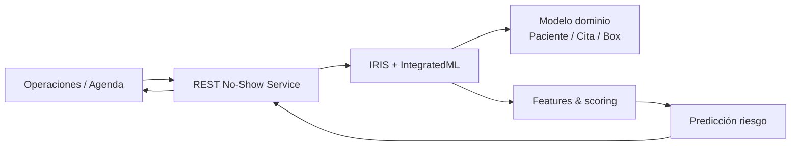

## Qué resuelve (mirada negocio)

Predicción de riesgo de inasistencia (no-show) integrada al flujo operacional de agenda.

**Dónde encaja**  
- **Decisores**: impacto en ingresos, eficiencia operativa, control y trazabilidad  
- **TI**: arquitectura reproducible, APIs, seguridad y ruta a producción

## Solución (qué hace)

- Describe el flujo end-to-end y el resultado observable (demo).
- Define puntos de integración (APIs, JDBC, servicios, colas).
- Deja evidencias en clases y módulos clave para revisión técnica.

## Arquitectura

## Evidencias técnicas (clases representativas)

- `src/IRIS105/REST/NoShowService.cls`
- `src/GCSP/Basic.cls`
- `src/IRIS105/Domain/Appointment.cls`
- `src/IRIS105/Domain/AppointmentRisk.cls`
- `src/IRIS105/Domain/Box.cls`
- `src/IRIS105/Domain/Patient.cls`

## Próximo paso recomendado

- **PoC guiada (2–4 semanas)**: definición de criterios de éxito + demo + backlog de hardening/producción.
