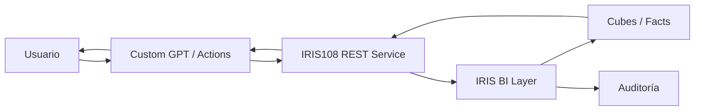

## Qué resuelve (mirada negocio)

Exposición gobernada de KPIs y cubos BI para consumo conversacional vía Actions/REST.

**Dónde encaja**  
- **Decisores**: impacto en ingresos, eficiencia operativa, control y trazabilidad  
- **TI**: arquitectura reproducible, APIs, seguridad y ruta a producción

## Solución (qué hace)

- Describe el flujo end-to-end y el resultado observable (demo).
- Define puntos de integración (APIs, JDBC, servicios, colas).
- Deja evidencias en clases y módulos clave para revisión técnica.

## Arquitectura

## Evidencias técnicas (clases representativas)

- `SISS-BI/CuboFacturacionCartera.cls`
- `SISS-BI/FactInvoiceCube.cls`
- `SISS-BI/CubeUtil.cls`
- `SISS-St/FactInvoice.cls`
- `src/IRIS108/REST/Service.cls`
- `SISS-St/GlosasAggByInvoice.cls`

## Próximo paso recomendado

- **PoC guiada (2–4 semanas)**: definición de criterios de éxito + demo + backlog de hardening/producción.
